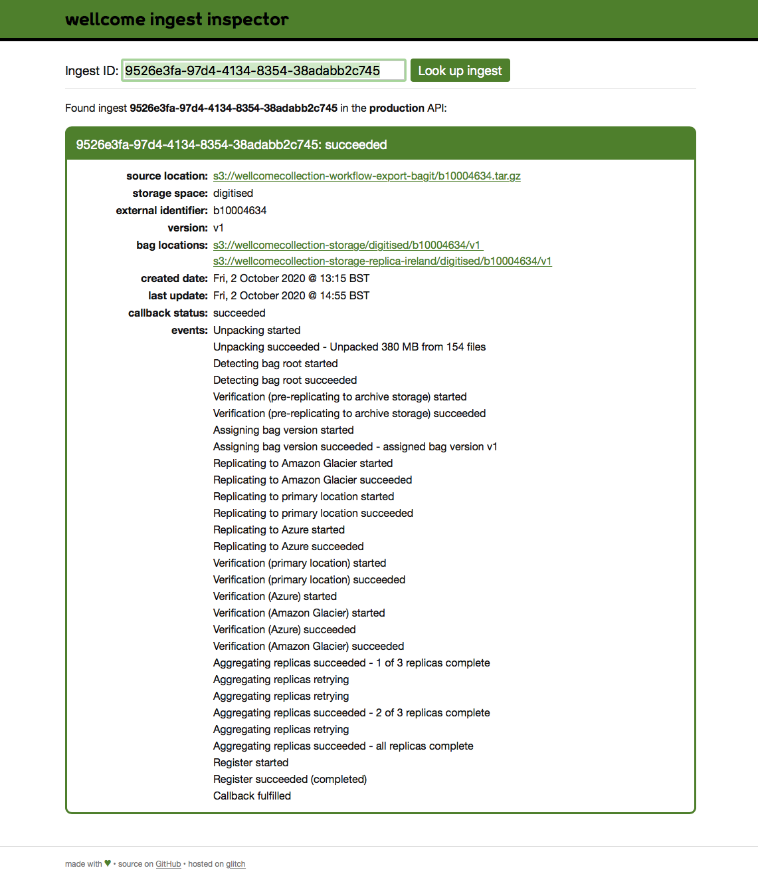

# wellcome-ingest-inspector

This is a Flask app that inspects ingests in the [Wellcome storage service](https://github.com/wellcomecollection/storage-service).

When a user asks the storage service to store a bag, they POST to the `/ingests` API.
The API gives them an ingest ID, which allows them to track the state of the bag -- whether it's been unpacked, verified, replicated, and so on.
Querying the API also involves a moderatedly fiddly bit of OAuth negotiation, so I built a Flask app that gives a graphical view of ingests.

This gives an easier way to track the state of an ingest:

The app is hosted on Glitch at <https://wellcome-ingest-inspector.glitch.me>
